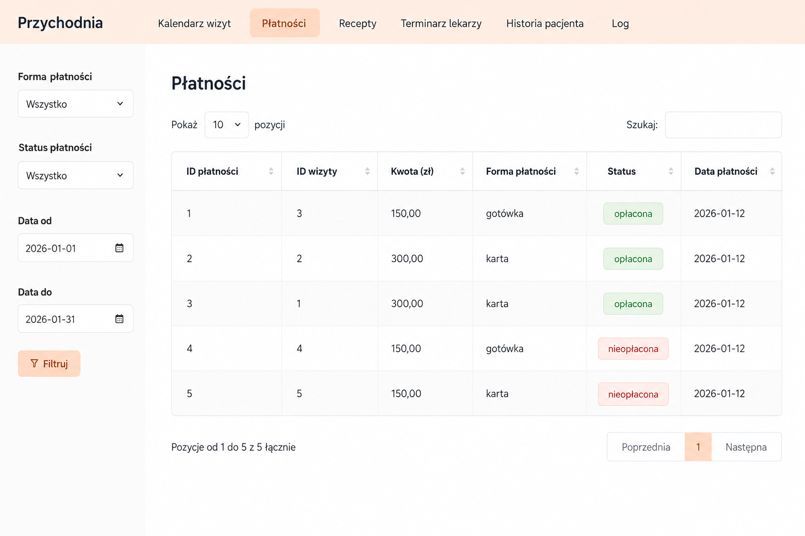

# Clinic Management SQL Project

Jest to projekt końcowy zrealizowany w ramach przedmiotu Bazy danych na studiach.
Przedstawia on prostą relacyjną bazę danych dla przychodni medycznej.

Baza umożliwia przechowywanie i obsługę informacji dotyczących:

- pacjentów,
- lekarzy i ich specjalizacji,
- gabinetów,
- terminarza pracy lekarzy,
- wizyt,
- recept i leków,
- skierowań,
- płatności,
- historii leczenia pacjenta.

Do bazy został przygotowany również prosty interfejs aplikacji, który pozwala przeglądać dane w bardziej czytelnej formie.

## Najważniejsze elementy bazy danych

Projekt zawiera tabele odpowiedzialne m.in. za:

- dane pacjentów i lekarzy,
- specjalizacje lekarzy,
- dostępność lekarzy w poszczególnych gabinetach,
- rezerwowanie i anulowanie wizyt,
- wystawianie recept,
- przypisywanie leków do recept,
- zapisywanie płatności za wizyty,
- przechowywanie skierowań.

W bazie zastosowano klucze główne i obce, które łączą dane z różnych tabel.

## Schemat bazy danych

## Relacje między tabelami

W projekcie występują m.in. następujące relacje:

- pacjent może mieć wiele wizyt,
- lekarz może prowadzić wiele wizyt,
- lekarz może mieć więcej niż jedną specjalizację,
- specjalizacja może być przypisana do wielu lekarzy,
- wizyta może posiadać receptę, skierowanie i płatność,
- recepta może zawierać wiele leków,
- jeden lek może występować na wielu receptach.

Relacje wiele-do-wielu zostały zrealizowane za pomocą tabel:

- `lekarz_specjalizacja`,
- `recepta_lek`.

## Widoki

Dla łatwiejszego pobierania danych utworzyłam widoki SQL:

- `kalendarz_wizyt` – lista wizyt wraz z pacjentem i lekarzem,
- `szczegoly_platnosci` – informacje o płatnościach i ich statusach,
- `zawartosc_recepty` – lista leków znajdujących się na receptach,
- `terminarz_info` – godziny pracy lekarzy i przypisane gabinety,
- `historia_pacjenta` – historia wizyt wybranego pacjenta,
- `specjalizacje_lekarzy` – lekarze wraz z przypisanymi specjalizacjami.

Widoki upraszczają zapytania wykorzystywane przez aplikację.

## Funkcje i triggery

W projekcie zastosowałam funkcje i triggery, które automatycznie kontrolują poprawność danych.

### Sprawdzanie terminarza lekarza

Przed dodaniem wizyty baza sprawdza, czy lekarz przyjmuje w wybranym dniu, o podanej godzinie i w danym gabinecie.

Jeżeli termin nie pasuje do terminarza lekarza, wizyta nie zostanie dodana.

### Blokowanie podwójnej rezerwacji

Baza sprawdza, czy lekarz nie ma już innej wizyty w tym samym dniu i o tej samej godzinie.

Dzięki temu nie można przypadkowo zapisać dwóch pacjentów na ten sam termin.

### Automatyczne ustawianie daty płatności

Jeżeli status płatności zostanie zmieniony na `oplacona`, data płatności jest automatycznie ustawiana na aktualny dzień.

## Kontrola poprawności danych

W bazie zastosowano m.in.:

- `PRIMARY KEY`,
- `FOREIGN KEY`,
- `UNIQUE`,
- `NOT NULL`,
- ograniczenia `CHECK`,
- `ON DELETE CASCADE`,
- `ON DELETE RESTRICT`.

## Podgląd aplikacji

Interfejs aplikacji umożliwiał przeglądanie:

- kalendarza wizyt,
- płatności,
- recept,
- terminarza lekarzy,
- historii pacjentów.

### Płatności

## Użyte technologie

W projekcie wykorzystałam:

- PostgreSQL,
- widoki,
- funkcje i triggery,
- klucze obce i ograniczenia integralności,
- R Shiny do przygotowania prostego interfejsu aplikacji.

