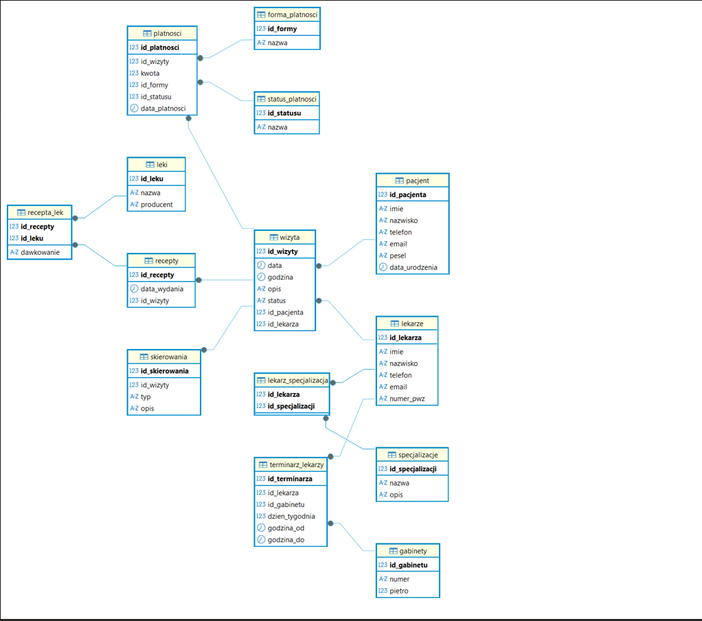

# Clinic Management SQL Project

This project presents a relational database system for managing a medical clinic.

## Technologies

- PostgreSQL
- SQL
- R
- Shiny

## Features

- Relational database design for a medical clinic
- Tables for patients, doctors, appointments, prescriptions, payments, referrals, and specializations
- SQL queries using JOINs, filtering, and aggregation
- R Shiny interface for adding, viewing, and managing records

## Database Schema

## Project Files

- `clinic-management-sql-project.sql` — SQL script containing the database structure and queries
- `ERD_schema.png` — database schema diagram

